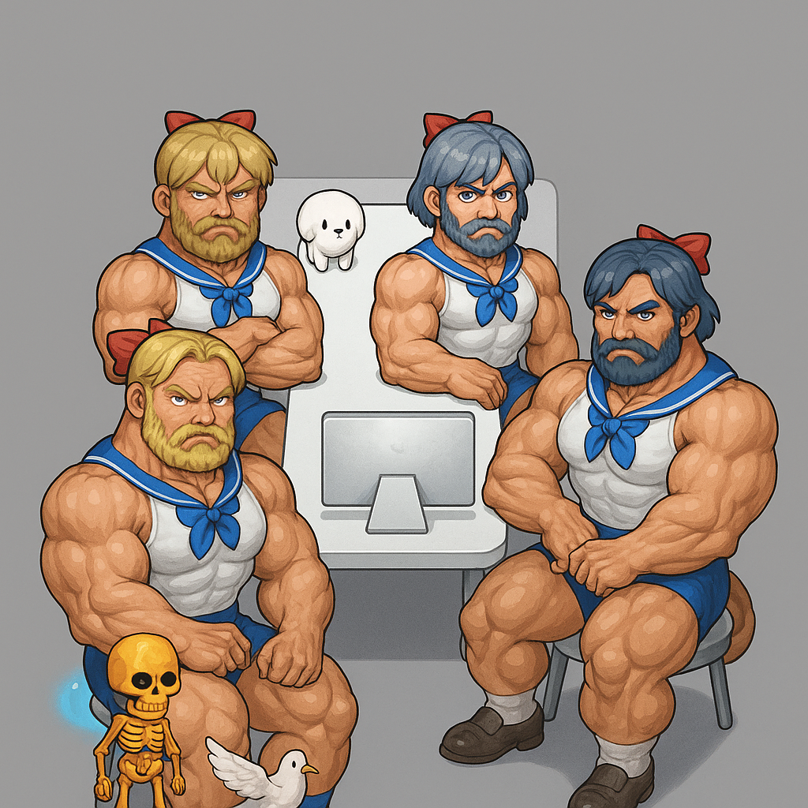

# Externship Project

## 📖 프로젝트 소개

> 수강생 간 소통으로 질의응답(Q&A)이 원활하게 이루어지는 학습 환경을 구축, 나아가 이를 AI 기반 자동 응답 기능과 연결하여 학습 효율을 높이는 `통합 교육 플랫폼(LMS)` !!

## ⭐️ 주요목표

> 단순한 Q&A 게시판이 아닌, 질문 등록 > 답변 > 피드백/채택까지 이어지는 흐름과
> AI가 학습자를 도울 수 있는 사용자 친화적인 인터페이스를 제공하는 것.

> 또한 실무 수준의 팀 협업을 위해 Lint/Prettier 설정 가이드, 배포 환경 구성, 공통 컴포넌트 설계 등의 기술적 환경도 함께 정립하며, 실제 서비스 구축과 유사한 개발 경험을 목표로 진행.

## 🔗 배포 링크

> ### https://oz-team2.kro.kr/

## 🖥️ 서비스 소개

> (영상 넣을 자리)

## 💪🏻 팀 구성 및 역할



## 🖤 팀장: 지정민

> 기술 전반 가이드 & AI 기능 구현

### UI 구현

- 질문 상세조회
- 답변 등록
- AI 답변 생성
- AI Chatbot

### API 연동 및 설정

- 린트/포메터/배포 가이드
- 공통 컴포넌트 & tailwind 설정
- AI Chatbot 연동
- AI 답변 생성 연동
- 답변 채택/댓글 등록 API
- 질문 상세/목록 조회 API

## 🤍 팀원: 윤강혁

> 질문/답변 등록 및 수정

### UI 구현

- 질문 등록/수정
- 답변 수정
- 답변 댓글 등록
- 답변 채택

### API 연동 및 설정

- 질문 등록/수정 API
- 답변 등록/수정 API

## 🤍 팀원: 박소연

> 인증 및 계정 관련 기능

### UI 구현

- 회원가입, 로그인
- 회원 탈퇴 복구 모달
- 아이디/비밀번호 찾기 모달
- 수강생 등록 모달

### API 연동 및 설정

- 회원가입/로그인 API
- 아이디/비밀번호 찾기 API
- 탈퇴 복구 API

## 🤍 팀원: 정상희

> 마이페이지 및 Q&A 리스트

### UI 구현

- 마이페이지/수정
- 회원 탈퇴, 비밀번호 변경
- 질문 목록 조회
- Q&A 리스트 카드
- 수강생 등록 모달

### API 연동 및 설정

- 마이페이지 API
- 비밀번호 변경 API
- 회원 탈퇴 API
- 수강생 등록 API

## 🛠️ 사용 기술 스택 (Tech Stack)

| 분류           | 스택 / 라이브러리                     |
| -------------- | ------------------------------------- |
| **Frontend**   | React, TypeScript, Vite, Tailwind CSS |
| **State**      | Context API, Custom Hook, Zustand     |
| **Auth**       | Supabase, OAuth (Kakao, Naver)        |
| **Style**      | Tailwind CSS, Lucide React Icons      |
| **Utils**      | Axios, React Router DOM, React Toast  |
| **CI/CD**      | Husky, Lint-Staged, Prettier, ESLint  |
| **Versioning** | Git, GitHub (Issues, PR, Branch 전략) |

## ✅ Commit Convention (커밋 메시지 규칙)

```markdown
- **형식**: `이모지 + 타입 + 메시지 (#이슈번호)`
- **예시**: `✨ feat: 로그인 API 연동 (#23)`
- **허용된 타입 목록**

| 이모지 | 타입     | 설명                |
| ------ | -------- | ------------------- |
| ✨     | feat     | 새로운 기능         |
| 🐛     | fix      | 버그 수정           |
| ♻️     | refactor | 리팩토링            |
| ✅     | test     | 테스트 코드         |
| 💡     | chore    | 기타 작업 (빌드 등) |
| 📝     | docs     | 문서 작성 및 수정   |
| 🚚     | build    | 빌드 관련 작업      |
| 🚑     | hotfix   | 긴급 수정           |

> 커밋 메시지는 [Husky](https://typicode.github.io/husky) + 커스텀 훅으로 검사되며, 형식이 맞지 않으면 커밋이 차단됩니다.
```

## 🗂️ Issue 템플릿 규칙

- GitHub 이슈 생성 시 템플릿에 따라 작성해야 합니다.
- 포함 항목:

```markdown
## Description

## To-do

- [ ] 항목 1
- [ ] 항목 2

## References

- 참고 링크 또는 자료

## 기타

- 유의 사항

## 🔧 관련 이슈

- 이 PR은 다음 이슈와 관련 있습니다: `#123`

## 🔄 변경 사항

- [ ] 기능 추가
- [ ] 버그 수정
- [ ] 리팩토링
- [ ] 문서화
- [ ] 스타일 수정
- [ ] 테스트 코드 작성
- [ ] 기타 (환경설정, 의존성 업데이트 등)

## ✔️ 변경 사항 상세 설명

- 변경된 파일:
- 주요 구현/수정 내용:

## 📸 스크린샷 (UI 변경 시 필수)

<!-- 예시:  -->

## 📝 문서화

- [ ] 관련 문서가 업데이트되었습니다.

## 🔍 리뷰어에게 요청 사항 (선택)

<!-- 예: 에러 핸들링 방식 괜찮을지 확인 부탁드립니다. -->

## ⚠️ 기타 주의 사항

<!-- 예: 이 PR은 hotfix이므로 빠른 병합이 필요합니다. -->
```

## 🔃 Pull Request (PR) 템플릿 규칙

```markdown
## 🔧 관련 이슈

- 이 PR은 다음 이슈와 관련 있습니다: `#123`

## 🔄 변경 사항

- [ ] 기능 추가
- [ ] 버그 수정
- [ ] 리팩토링
- [ ] 문서화
- [ ] 스타일 수정
- [ ] 테스트 코드 작성
- [ ] 기타 (환경설정, 의존성 업데이트 등)

## ✔️ 변경 사항 상세 설명

- 변경된 파일:
- 주요 구현/수정 내용:

## 📸 스크린샷 (UI 변경 시 필수)

<!-- 예시:  -->

## 📝 문서화

- [ ] 관련 문서가 업데이트되었습니다.

## 🔍 리뷰어에게 요청 사항 (선택)

<!-- 예: 에러 핸들링 방식 괜찮을지 확인 부탁드립니다. -->

## ⚠️ 기타 주의 사항

<!-- 예: 이 PR은 hotfix이므로 빠른 병합이 필요합니다. -->
```
